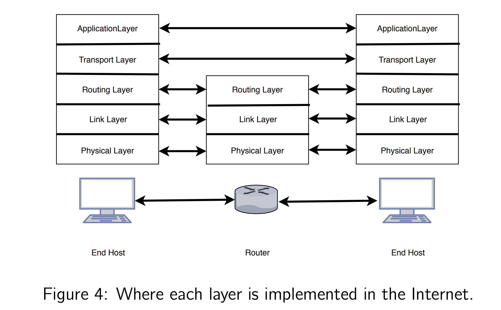

# Computer Networks
- Professor: Anirudh Sivaraman
# 1/22/24
### Application Layer
#### How does a computer communicate with another?
1. identify other computer -> IP address
2. tell it you want to talk to it
3. transfer info
^ All of this is encapsulated in sockets library/api
### Transport Layer
- how are sockets implemented?
    - reliability
        - if i have information, ex. "hello", and i want to send it, how do i make sure it gets there in exactly that form... not "elohl" scrambled
    - congestion control
        - part of the system that cannot move info quickly enough, so there's a backup of information
### Routing/net Layer
how to get from point a to point b?
- finding shortest path between a and b
- piece of data is called a packet, groups of bits
- called the medium access layer
    - transmission medium ex. air, cables, etc.
- needs to be able to survive faults
### Physical Layer
- voltages, antennas
- analog world
### Last third of course
- field is in flux because communication shows up in different contexts
- new uses for networking
- new tech in layers

# 1/24/24
### The Internet
Definition: An internet is a network of interconnected networks
- network meaning some way of connecting computers using some technology (cable, radio, etc)
#### early applications of networks
1. first demo of networks is the arpanet
2. also the arpa radio network (wirless based)
3. NPL
4. Cyclades
#### requirements implemented for the internet (goals)
1. low effort interconnection
    - these networks need to be able to attach to each other without adding additional software or hardware to existing networks
2. generality
#### non goals
1. performance
2. security
#### how these goals were achieved
1. low effort interconnection
    - idea is to get sub networks to participate in the global internet
    - say we have two networks, how will we connect them?
        - simple answer, one edge connects to undirected graphs
    - an IP address: is the universal identifier for hosts
        - a host sitting around in one network wants to read info from a host in another network, the IP address i shared
    - routers could do more than just forwarding on destination IP addresses like prioritization, load balancing
        - but want to keep routers as simple as possible! just want everybody to agree on addresses, and it tells to send a packet one way or the other
2. generality
- the idea that you should be able to run anything on the internet
    - each layer does one thing well
    - it has clean interfaces/contracts with neighboring layers
app layer
- many different apps
transport layer
- connect a process on one host to process on another host
- provide the service or reliability (TCP)
Routing layer: global delivery
- ex. how do i get data from my machine to a google server sitting in Mountain view, maybe an ISP in NJ to an ISP in kansas, to an ISP in CA; cooperating to ensure global delivery
MAC layer: local delivery
- medium access control
- way of identifying things within a local network
Physical layer: rubber meets the road 
### Packet vs Circuit switching
- how does data get to its destination?
#### circuit switching
- data goes through switches in the computer network
- telephone native
- switches have configurations: if data comes in one way, then it must go out a certain way
#### packet swtiching
- divide data into chunks called packets
- attach destination address as a header to the packet
- replace telephone exchange switches with packet switches
    - switches dont need to setup information with a circuit from a to b, no need for all those configurations
    - they can look up in a table that tells them the neighbor they need to go to to get to B -> routing tables
#### pkt vs ckt
1. no setup time
2. less stuff on switches
3. fault tolerance
### Where 5 layers reside?
PKT swtiching/internet performance

# 1/29/24
### Where do the 5 layers reside?
as a stack that resides on all hosts
- app
    - typically in user space
- transport
    - typically in the kernel
- routing
- MAC
- physical
routers only implement
- routing
- MAC
- phys
between hosts


### internet performance
#### initially
- when it was just phones and wires, the question was more, was the phone call accepted or denied
    - is there enough capacity for the phone call to happen
    - one in one out, phone call using one path and no one else using that path
#### over time
- when it transitioned into computers and packet switches and routing tables, then what happens when two packets arrive at a switch at the same time
    - two things coming in, only one thing allowed to go out at a time (same as a queue in a grocery store)
    - this is queueing theory at its core
    - need to hold packets on the switch, maybe eventually you have to drop packets since there's not enough space
    - this manifests into **delay/latency** -> the time between the packet being visible at 2 different points (so the time spent travelling to a point basically)
        - queueing delay
        - transmission delay
            - every connection has a finite capacity on the number of bits it can ferry from one point to another
            - $transmission delay = \frac{pktsize}{link capacity}$
        - propagation delay -> L/C
            - length over the speed of light
            - speed of light delay
            - minimum amount of time to get info from one point to another
#### throughput
- if a link coming from a switch is 15 mbit/s but two links are sending 10 mbit/s to that switch, how does the throughput split the data?
    - scheduling problem
    - 10 and 5? -> work conserving algorithm, priority scheduling (as long as A has packets to send, i'll send A's packets preferentially)
    - 10 and 0? -> non work conserving algorithm
    - 7.5 and 7.5? -> work conserving algorithm (fair queueing)

### Identifying hosts
1. IP addresses: numeric (10.23.5)
    - this is for the internal implementation for the host to have a fixed length identifier
2. Host names: english readable (google.com)
    - this is for you and i to remember
#### private and public IP addresses
- initially designed so everybody has a public IP address
    - but realized they were running out of IP addresses
- so now there's Class A, B, C IP addresses that differ in length/size of IP address
- private IP addresses allowed people to re use the same IP addresses
    - what we all see when we connect to residential wifi, ex. 192.68....
    - meaning: my ip address needs to only be visible to my wifi access point
    - analogous to local and global delivery -> so private addresses do local addressing
#### DNS
- need a way to go from host names to IP addresses
    - early way to do it was to put host name and IP address in a file lol, host.txt
- Domain Name System is a global telephone directory for the internet
    - to deal with scale, it exploits hierarchy
    - ex. mail.google.com
        - subdomain is subdomain, google is Domain, com is TLD
        - there is a distributed system to take strings and turn them into ip addresses, where the hierarchy is root servers, PID servers (com,edu,org), authoritative servers

# 1/31/24
root servers-> TLD servers(.com,.org,.net) -> servers (google.com)
Option 1: non authoratiative server: operated by campus nets/ISPs
- dont need to talk to root server hierarchy, saves a lot of latency
Option 2: cache DNS mappings
- a list of hostname and IP address, cache it locally

TCP allows reliable byte string abstraction
- if you send bytes, you will get bytes on the other side

### Socket Demo
#### write something that allows us to send data
```py
from socket import socket
sock_object = socket(AF_INET, SOCK_DGRAM) # two arguments -> (family of sockets, type of socket)
sock_object.sendto(b"hello", ("127.0.0.1",8000)) # two arguments (byte array, (address to send to;currently local host; and port))
sock_object.sendto(b"hello\n\nhi", ("localhost",8000)) # two arguments (byte array, (address to send to;currently local host; and port))
```

#### create something that can receive UDP packets on the same machine
```bash
nc -l 8000 -u # get me a udp socket attached to port 8000, port distinguishes applications on the same machine
# this will receive messages from the socket above
```
#### python equivalent of above
```py
from socket import socket
sock_receiver = socket(AF_INET, SOCK_DGRAM) # two arguments -> (family of sockets, type of socket)
sock_receiver.bind(("localhost",8000)) # bind tells socket to attach to specific port number
sock_receiver.recv(4) # argument tells how many bytes you want to receive
sock_receiver.setblocking(False) # non blocking, does not wait til data is available, it returns right away
```
#### what is the benefit of non blocking -> having data right away or no data
- you can do other work

### polling - checking different sockets to see if there's data wastes CPU
- like a while loop constantly checking sockets
- this reduces latency but takes up all resource

### select system call - the alternative
- get a bunch of sockets, put in an array
- one system call select, take entire array as input
- wait until any of the sockets have data in them
- sort of like a blocking call on a GROUP of sockets
```py
from select import *
r = select.select([s1.fileno(), s2.fileno()], [],[], 1.0) # returns when one is ready to be written
# wait on array in filedescriptor array
```
#### documentation
select.select(rlist, wlist, xlist[, timeout])
This is a straightforward interface to the Unix select() system call. The first three arguments are iterables of ‘waitable objects’: either integers representing file descriptors or objects with a parameterless method named fileno() returning such an integer:

### TCP sockets

#### send data
```py
from socket import *
tcp_socket = socket(AF_INET,SOCK_STREAM) # family is the same, still talking about internet, but type is sock stream referring to byte stream -> hello on one end will come out as hello on the other end, not hello -> olleh
tcp_client = socket(AF_INET,SOCK_STREAM)
tcp_client.connect(("127.0.0.1", 8000))
tcp_client.send(b"hello")

# new client
tcp_client2 = socket(AF_INET,SOCK_STREAM)
tcp_client2.connect(("127.0.0.1", 8000))
tcp_client2.send(b"helloworld")
```

#### receive data
```py
from socket import *
tcp_server = socket(AF_INET, SOCK_STREAM)
tcp_server.bind(("127.0.0.1", 8000))
tcp_server.listen() # not specifying bytes, because its a 3 way handshake, need to be synced up to provide a reliable byte stream, so puts server in a mode to carry out synchronization
(comm_socket,client_addr) = tcp_server.accept() # for the TCP server, to know how to actually reach the client -> so once tcp server has accepted connection to client, then we can receive data on a different socket, the job of actually receiving and sending data is on a different socket
comm_socket.recv(5) # note that recv is on a different socket than tcp socket

# this is a new client on the same TCP server
(comm_socket2,client_addr2) = tcp_server.accept() # accept returns sockets to allow you to interact with all clients connected to you
comm_socket2.recv(5)
```

#### why the TCP delagates data send/receive to another socket -> it needs to listen to another connection attempt!
- this does not exist in UDP, there is no notion of agreeing
- all TCP guarantees says is that if you send a byte from one end it will get to the other end, does not say anything about the receive
    - stream finishes when you close
- byte stream starts with first byte sent after connection established, ends wtih the close call of the client socket

# 2/5/24
### Reliability problem
- one host and another host
- network in between
    - network can arbitrarily do anything
    - drop, delay, reorder packets
    - but it eventually delivers each packet
- the goal is to send bytes in an order and they should appear in that order on the other end
- ex. send Hello and we get Hello on the other
### solution to reliability
- receiver confirms receipt of packet (acknowledgement or ACK)
- sender attaches a number to every packet (sequence number)
- HELLO
- 01234
- receiver says they got sequence number 0, 1, etc
#### stop & wait protocol
- sender
    1. Tx(transmit) the 1st packet
    2. wait for ACK; re tx (re transmit) if needed
    3. repeat w/ 2nd, 3rd, 4th pkt
- receiver
    1. send an ack for just rx pkt
    2. maintain variable next in order
    3. if rx pkt's seq number = next in order, increment next in order
- this cares about in order reliability
### throughput of stop & wait
- minimum round trip time
    - pkt sent, but also ack needs to be sent back
    - abbreivate as RTT min.
- Tpt (throughput) = packets per unit time
- stop and wait -> 1 packet per RTT -> 1/RTT
- queing delays are more or less 0 because the link capacity exceeds the average throughput going into it
- ex.  tpy = 120 kbits/sec and capacity = 100 mbits/sec
- if the link capacities are much lower, then queues will build up
- but this is only for one conversation going through -> stop and wait doesnt produce enough throughput
- and for extremes -> we want to keep it under 50%, this warrants increasing capacity
#### how can we improve throughput of stop and wait?
- we don't have to wait for ack. -> the line goes idle
- so maybe instead of waiting, dump more packets into the line
- number of packets you keep unacknowledged is called the window (sliding window)
- eventually acknowledge this window of packets
### how long do you wait for an acknowledgement before a packet is "lost"?
- wait for the RTT + a little bit of time (epsilon) ; after the RTT the packet is lost
- this is because the RTT is the time a packet should take and be sent back
- how does the sender know this time? it keeps timestamp of when it sends and when it gets ack -> this gets RTT for future packets
#### stats for RTT
RTT and stats
- model RTT as a normal distribution
- mean and standard deviation
- RTT is the mean + little bit around it is the sd
signal processing to estimate mean and sd
- basically averaging past mean and most recent sample
- timeout (the little time that we add) is set to 4 standard deviations away
# 2/7/24
### From last time
- retransmission timeout
- timeout = $\mu + 4\sigma$
- Pr(RTT > Timeout) should be small
    - also called the probability of spurious retransmission
- how to find $\mu$ and $\sigma$?
    - exponentially weighted moving average
    - formula on slides
#### note
- throughput of stop & wait is quite low
- 1/RTT
- this is because we're waiting for an acknowledgement after every packet send
### Sliding Window Protocol - Sender
- we want reliable and in order delivery
- Sender
    1. send out w packets at once
    2. wait for ack for any of these w
    3. when you get an ack, release 1 more pkt
- sending out w packets at once, theres still a gap between sending the packets
    - this is because we can only send one at a time. Why?
        - voltages, transmission delay
- window is the packets that havent been acknowledged, so you can add a new packet at the end of the window every time you get an ack
- formal def -> window: set of unacknowledged packets
    - window slides from [0,1,2,...,w-1] to [1,2,...,w] to [2,3,...,w+1]
- invariants: Always keep w pkts unacknowledged
- packet conservation principle: put a packet in for every packet out
### sliding window - receiver
- Receiver
    1. ack every packet you receive
    2. receiver might have to buffer out of order packets
        - packets that do not form a contiguous sequence
        - why might this happen?
            - scenario: sender sends w packets
            - S: [0,...,w-1]
            - R: {0,2,5,...,w-1}
                - sender realizes 1 was dropped so it decides to retransmit
                - 0 enters buffer then delivers to the app since its inorder
            - then R: {1,2,5,...,w-1} this is the buffer
                - now 0,1,2 can be delivered to the application
            - then R: {5,...,w-1}
    - just need to look for in order packets, and send those out
        - nextinorder variable
        - what if buffer looks like R: {15,16,17,18,20,21}
            - nextinorder = 14
        - so then R: {14,15,16,17,18,20,21}
            - after sending 14-18 acks
            - nextinorder = 19
    - how does the sender know to retransmit if a packet is dropped?
        - that RTT and timeout time
        - the invariant is satsified because if you realize a packet is dropped then w is decreased then you send it again and w is increased again
### sliding window throughput
- send out w packets, an RTT min later, you get w acks
- 1/c is the time between the w packets sends, but its actually w/c
    - we can assume this is very small w/c << RTT min
- so the throughput is w/RTT min
    - big win against stop and wait
- can you keep increasing w and get more and more throughput?
    - run out of capacity
    - once w > c,then w = c
- tpt = min(w/RTT, c)
    - you cant send more than the capacity of the link
- when w/c becomes comparable to RTT min, arrows sent will start overlapping arrows coming back
    - bandwidth delay product w>c*RTTmin
        - want this to be close to bdp but you dont want it to overlap
- so window needs to be close to the bandwidth delay product (the point when w exceeds cRTTmin)
- when w exceeds BDP -> you get queuing delays, because your throughput to a link exceeds the output
    - Q(in packets) = w-c*RTTmin
    - c is the speed that Q drains -> so speed to get through the queue (queue latency) is Q/c
        - Q (Q such packets that need to be serviced) * 1/c (service time)

queue delay = w/c - Rttmin
- want w to exactly hit the BDP, w=BDP

# 2/12/24
### Congestion Collapse
- w >> w*
    - w is much greater than w* (w* is the BDP)
- figuring out w* is hard:
    - w* = (c x RTTmin)/n
    - c is unknown because capacity can keep varrying over time
    - RTTmin is min RTT
    - n is # of flows
        - flow = sender - receiver pair
### congestion collapse informally
- when w > w*
    - large queuing delays
    - trigger retransmissions
    - queue has many duplicate of the same packet
        - because packets stuck in queue, but sender still times out
        - c is packets coming out per second
        - time between 1 packet and the next coming out of queue -> 1/c
        - number of unique sequence numbers per unit time (if every packet has one duplicate) -> c/2
            - the "goodput", useful work that the link is doing
- no/little dropped packets
- crowded room example
- tragedy of the commons
- if a lot of people are using the same band, no one can hear

### cong collapse, formally
- offered load (input to the system)
- utility function & agg utility function
- offered load is increasing but agg/overall utility is decreasing

### setup for congestion collapse
1. n flows
2. each flow has a window W
    - effective window = nW
3. each flow has same min RTT -> RTT
4. share the same bottleneck link
    - bottleneck -> exactly where the queues build up that causes congestion
5. bottleneck link capacity is C
6. link has infinite buffers (never drops a packet)
7. no ReTx at all
8. utility function for each flow
    - Throughput/Latency
9. Agg utlity function = Sum_f Tf/Lf

# 2/14/24
### Congestion Collapse Leads to Intuition About Window Size
- instead of a set window size, realized that the window size should be adapted
- adaptively find a sliding window size equal to the BDP of their network

### AIMD Algorithm
- the algorithm to adjust window size
- two aspects:
1. slow start
    - how you get to the right value of window size
2. congestion avoidance
    - maintain right value of window size when you get there even when senders are coming and going -> compensate for packets not being sent anymore

### slow start
- goal: $W_{target} = w^*/n = c*Rtt_{min}/n$
- get to this W target (correct window size)
- binary search alg

### congestion avoidance
- additive increase or multiplicative decrease to maintain the window size
- so slow start gets you to a target value, and congestion avoidance lets you dance around that target value

### So the alg
1. start with w=1
2. mult. increase w til packet loss (2*W)
3. mult decrease w (w = w/2)
4. additive increase w (w = w+1)
5. mult decrease w on loss (w = w/2)
- note: theres no concept of time
- time is increased as acks are sent back
- how to increase w for slow start?
    - increase w by 1 for every ack (every ack) is the same as 2*w_t(every RTT)
- if you have a timeout: w = w/2
    - a sender gets impatient and retransmits
- congestion avoidance
    - w_{t+1} = w_{t} + 1 -> additive increase for every RTT (t is RTT second -> time)
    - so for every ack -> w = w + 1/w

### why the combination of additive increase and multiplicative decrease (AIMD)
- you want to be fair, window size to be fair
- you also want window size to be w*
- so for two windows for two people, theres an intersection between fair and efficient
- MIMID for two windows would make them stay on the same line goig down to 0, AIAD as well but perpinducular to the efficiency line
- MIAD is unstable
    - you don't come back nearly enough, and the next MI takes you farther away from the initial starting point

# 2/21/24
### routing layer
    - global delivery of packets
    - gets packets from one end host of a network to another through a sequence of routers -> a path
    - find a path: routing
    - send packets along path: forwarding
- control plane: determining route/path between A & B
- data plane actually sends packets along these pre-computed paths when a new packet shows up at a router
    - at every node, which packet to go to

### how often does control plane kick in and how often data plane kicks in?
- control plane kicks in when topology changes (considering a graph)
    - ex. a router dissapears
    - ex. or when it starts, only need the path to others once
    - about every 1 ms (milli sec)
        - due to this, typically on a general purpose CPU with a few cores
- data plane kicks in when a packet arrives on a link
    - about every 1 ns (nano sec)
    - implemented on specialized hardware where people make special circuits to forward

### simplest instantiation -> routing table
- map from destination address to output port
- at each router, say which router you need to go to next to get to a destination
    - ex. to get to C -> go to 3
    - so basically a table at each router
- the contÍol plane writes these tables
- data plane reads ffrom these tables
- NOTE: we're talking about intradomain routing (one network)
    - domain, collection of networks, owned by same entity

### question
- how do you run djikstras in a distributed setting where each network doesn't know what the entire global network looks like?
    - get info about neighbors

### link state routing protocols
- the link is the edge in networking terms
- link state is a property of the edge like propagation delay or queuing delay
- every node collects link state information from all the links its connected to
- sends a link state advertisement to all its neighbors
    - link state advertisement is the information about the neighborhood of each node
- then run djikstra's

### distance vector protocol
- state: distance vector
    - map from destination address to distance
1. send DV to neighbors
2. upon receiving DV,
$\forall v, d_R(v) = min(d_R(v),d_N(v) + link\_metric_{R,N})$
    - destination is v
    - where you are is R
3. if R's DV changes, R tells its neighbors

# 2/26/24
### internet
- maybe you have google network, comcast network, nyu network
    - routers sit inside these domains
- how do you get global connectivity? communication between the domains
- domains have routers at the edge of the domain, border routers
    - border routers talk to other border routers for info, serve as representatives for the domains

### inter domain routing
- from source to destination, what domains do we go through
    - AS will represent the domain/network
- say D1 owns a block of IP addresses like 10.2.3.* (prefix)
    - D1 tells D2: to get to 10.2.3.*, send pkts to D1
    - D2 tells D3: to get to 10.2.3.*, send pkts to D2,D1 (as a path)
    - D3 tells D4: to get to _____, send pks through D3,D2,D1

### BGP: Border Gateway Protocol
- selective import and export of advertisements (local preference)
- how do border routers talk to other border routers?
    - eBGP: interdomain routing, establishes what sequence of domains you have to go through
    - runs over TCP for reliable delivery of packets
- how do you get information from the border router into the domain itself?
    - iBGP: propagate information learned from eBGP into a domain, takes sequence of domains and within each demain exports the info
        - R3 tells R1 R2 R3 R4 that to get to a please send pkts to R3
            - once in a domain then intradomain routing takes over

### relationships between domains
- two domains from NYC to Philadelphia
- peering -> each ISP carries traffic on behalf of the ISP for free
    - if theres an imbalance maybe its not economically equal for both ISPs
- customer provider relationship
    - only carry traffic if one of the sender or destination is a customer
    - carrying out routing decisions to advance economic incentives

### internet
- hierarchy of tiers of ISPs
- want to avoid valleys

### flattening
- want to bring content closer to users
- local ISPs have relationship to regional ISPs
    - but might also have a peer relationship to content provider like google

# 2/28/24
- hosts and routers: goal is to get from host A to host B
    - as we've seen before we use routing tables

### exact matching
- you have a destination address and look at each entry in the lookup table for the same dst address
- what is better?
    - hashmap
    - but there are so many addresses say for example 32 bit addresses then there could be 2^32 entries

### longest matching
- Destination address -> lookup module -> lookup table
    - but in the lookup table, group of addresses can represent single entries
    - represent IP addresses as a group of bits + a "*"
        - star meaning it can differ
        - so 001001 and 001000 would be 00100*
        - 00100 is the prefix, "*" is unspecified
    - so columns of lookup table are prefix and NH
- 1****** represents 32 addresses with one entry
- what if you have multiple matches?
    - find the most specific, the longest prefix (hence longest prefix matching)
    - take the one with less wildcards(*) in the match
    - in practice , *s are only at the end of the address

### implementation
- in software:
    - write code, give to compiler, produce executable, run executable
- in hardware:
    - take functionality, devise digital circuit, realize this circuit through boolean gates

### LPM Module
- trie
    - go down this tree like data structure to find the IP address
        - when you stop, that is the longest prefix match

#### exact match module
- in software, hash table

### Hardware Implementation of Forwarding
#### exact match in hardware
- take destination address -> put into hash function which gives an index in a table
    - to deal with collisions, can either have a linked list or do linear probing (put in next available slot)
- 2 choice hashing
    - hash1 and hash2 and choose the better one?
    - choose the one with the lesser occupancy of the linked list
- 2 left hashing
    - hash1 and hash2
    - partition the table two ways
    - hash1 picks at random an index from the top half of the table
    - hash2 from bottom half

### Hardware for 2PM
- TCAM
- similar to hash table where we have bit by bit comparisons
- but instead of bits, there is a ternary digit that allows you to store 1 or 0 or a *

### 

# 3/4/23
## midterm review
#### What were the goals of the Internet when it was first developed? How was this a departure from the goals of the telephone network?
- low effort interconnection and generality
- phone networks was built for the purpose of just voice calls
- from these goals arise differences in techniques like packet switching vs circuit switching
- also non-goals
    - performance
    - security
    - cost

####  If your applications send a lot of traffic 50 % of the time and stay dormant 50 % of the time, does it make more sense to use packet switching or circuit switching? Why?
- if only using it 50% you might as well let someone else use it for the other 50, so packet switching 
- A can be active ana B can be active but rarely the case that both are active at the same time
    - this is the risk that the internet takes
- what would happen if you used a circuit switched network
    - constant connection
    - reserve a circuit for the purpose of some person's communication, if they're not communicating the line remains idle, so it's underutilized

#### What if each application sent a steady low-rate stream of (say) 60 kbit/s, such as audio? Would it make more sense to use packet or circuit switching now?
- circuit swtiching
- performance is predictable from the applications perspective because that circuit is dedicated to that application alone
- consistency is the main thing here; you don't want queues from other applications

#### Say you were loading a web page (www.google.com/index.html) from your laptop. Describe exactly how this page load happens starting from the application layer all the way down to the physical layer.
- application layer: send DNS request for google.com, it comes back with an IP address, then uses sockets API to request a document or page from that IP address
- transport layer: Connection establishment (using accept/listen) and reliable and in order delivery of HTML/css/js pages
- routing layer: handles what happens from access point to google's server, BGP is the protocol for interdomain routing, intradomain routing within the concept of a single network the routing protocol is either link state or distance vector routing (edge of one network to edge of another network)
- link layer: handles packets from laptop to access point once you know the first router to get to
- physical layer: cable or antenna to translate bits into voltages

#### If the minimum round-trip time on a path is RT Tmin, what is the throughput of the Stop-And-Wait protocol? What is the throughput of the sliding window protocol?
- 1/RTT stop and wait
- w/RTT sliding window
- explain as well

#### At some point, a receiver in the Stop-And-Wait protocol has received the following sequence of packet sequence numbers: 1, 2, 3, 4, 7, 8, 10, 12, 13, 14. Is this a valid sequence? Why or why not? Is it a valid sequence in the sliding window protocol?
- stop and wait no, it needs an ack
- sliding window you can have arbitrary gaps

#### What happens if everyone uses a large window in the sliding window protocol? What happens if everyone uses a small window?
- large window -> leads to congestion collapse
    - everyone times out and retransmits packets
    - if you keep retramsmitting packets a link could be full of duplicate packets
- small window -> underutilization of the network
    - lots of capacity and you can use it but you're not trying hard enough

#### Give a few examples of congestion collapse. Explain precisely how the offered load is measured in your example, how a user’s individual utility is measured, and how the aggregate utility is measured? Draw a curve showing this congestion collapse graphically for your chosen example (don’t draw a generic congestion collapse figure).
- 3 examples in lectures
- specify the x axis (offered load, or number of senders, etc) and the y axis (utility could be throughput, throughput/delay, etc)

#### Show the workings of the distance vector protocol on this particular example. Assume it takes one time unit to send a DV advertisement on any link. How long does it take for node A to learn about a route to node B?
- there's an equation, look at answer key

#### Let’s assume you are on a link with a capacity of 10 Mbit/s and a minimum round-trip time (i.e., excluding queueing delays) to the server of 10 ms. Let’s say you want to retrieve a file from the server as quickly as possible. Consider two cases: a small file that can fit into a single maximum-sized packet and a large file that needs several thousand such packets. You have two choices to improve network performance: you can buy a better link with higher capacity or you can move the server closer to you. Which choice makes sense if you want to minimize the total time that it takes for you to retrieve the file from the moment you issue the file retrieve command? Answer this separately for the small and large file case.
- assume latency is transmission delay, propagation delay, queuing delay
- for smaller file: bring the server closer to you
    - for a smaller file, the transmission delay is very small
- for larger file: increase capacity for the link
    - transmission delay if very big

#### In an interdomain routing protocol such as BGP, what is the consequence of not authenticating a route advertisement? Demonstrate one example in detail where you think a router lying in its advertisements could severely disrupt Internet service.
- authenticating: a person could be something like SSO, a route advertisement -> if someone says they can send data to a particular destination they are telling the truth
- youtube example: route advertisements were not authenticated
- soon everybody was sending data and the path didn't exist, so all the data got dropped

#### Between AIMD, MIMD, AIAD, and MIAD, which of these protocols are suitable to guarantee both efficiency and fairness starting from an arbitrary value of the window size for two senders. Demonstrate this graphically using the phase diagram we used in the lecture.
- AIMD
- additive increase gently
- multiplicative decrease gets you back to non loss more quickly

#### Why is DNS structured as a hierarchical collection of servers?
- allows DNS to scale to a large number of domain names
- ex. TLD server for .com TLD is only responsible for domain names that end with .com
- there is a division of responsibility where each entity is only responsible for a portion of domain names

#### Give a few examples of where using hierarchy allows the Internet to scale better.
- domain name system, public vs. private IP addresses, intra vs intra domain routing

#### How does the gain parameter α affect the retransmission timeout calculation?
- A large alpha makes the timeout calculation converge faster to a new set of RTT values, while a small alpha is more sluggish.

# 3/11/24
### Source of Queues
- if input is greater than what we can send out per unit time, then some packets will have to wait
    - input exceeds output over short periods of time
- in our case, what happens when multiple inputs want to send to same output port

### memory for queues
- where do the packets go when the queues build up?
- FIFO
    - a usual queue
- priorities
    - like packet size
    - packet sent time
- fair queuing
    - round robin and multiple queues

### hardware for FIFO
- question: how many simultaneous enqueues and dequeues do you see?
- assume a packet comes every tick on every input port and a packet departs on every tick from every output port
    - 3 and 3

### shared memory
- common pool of memory for all input and output ports
- benefit: better utilization

### output queues: not shared memory
- each output port has fixed memory
- how many E & D per tick? assuming n = 3
- 3 E and 1D
- N E & 1D
- advantage: less operations per tick
    - NE & ND
- disadvantages: doesnt fully utilize memory
    - what if one output port is more used than others, the memory is not utilized, so that one output port should need more memory

### input queues
- move queues from output side to input side
- pros: 1 E & 1 D
- cons: head of line blocking -> input queues want to go to same output port so the output port will have to pick which one it uses, not fully utilizing memory

### bipartite matching
- at most one port to an input

### Virtual output queues
- for each input queue, organize a set of FIFO data structures, one per output queue
- so when you match, you can look at any of the locations to pick better matches
- input port sends a request to every output port for all of the packets in its queues
- output port gets a bunch of requests from every input port, and picks one at random
    - sends a "grant"

# 3/13/24
### from last time
- head of line blocking -> too many packets arrive to an input where the head is blocked because the output chose another queue, then the queue gets very large

### the fix
- each input port has n queues (n being number of inputs)
    - each queue only contains packets destined to a certain output

### PIM: Parallel iterative match
- each input port sent a request to all the output ports for which is has packets
- output picks one of the requests at random and decides to "grant" it
- grants go out at the same time, so it could happen that there could be multiple grants to multiple inputs
- so the input has to "accept" as well, and pick the output port

### MAC Layer
- link layer
- the local part of the network
- two kinds that we talk about:
    - shared medium
        - the medium of communication (electromagnetic waves, sound waves, etc) is shared in that everybody can use it over a shared space; ex. like radio signals
        - everybody needs to coordinate with each other so they don't interfere at the lowest level and waves dont cancel each other out etc.
        - bus based ethernet -> giant cable and machines can tap into this cable to send data to each other -> this is shared because data is not isolated, data is in the same cable
    - unshared medium
        - a cable is unshared, if you connect to a cable all of your signals are isolated
        - but some can be shared look above

### frequency range for different comm. technologies
- TDMA: time division multiple access
    - time slice given to a user for a use of comm technology
- FDMA: freq dividion multiple access
    - frequency divided among users for access
- centralized authority: the base station
- multiple entities are contending to use the protocol at the same time, so how do we make them take turns? without using a centralized authority
    - ex. verizon centralized authority; only paid subscribers can access this
    - but with wifi anyone can join

### ALOHA: simplest contention based protocol
- you have a central data server and a bunch of islands in Hawaii
- islands are far away so they dont know if other islands are attempting to transmit
- if island sends packet and you dont get ack back you assume your packet collided with someone else (transmit at same time)
- each island transmits with probability $p$
- N sends each tx with prob p, what is the probability of a successful transmission?
    - $P_{Success} = N * p * (1-p)^{n-1}$
    - the probability of one transmission is the probability of tx and the probability of all others NOT transmitting
    - why multiply by N -> because there are N possible ways of a successful transmission, any of them could have a successful one
- what is the p that maximizes P_Success?
    - take the derivative and set it to 0 (maximize a function)
    - $p = \frac{1}{n}$
- the graph looks like congestion collapse
    - if probability is low there might not be many collisions, but the medium may not get used
    - if probability is high there might be lots of collisions
    - so graph goes up then down
- note:
    - you don't know N so you cant calculate 1/N for optimimal p
    - so needs to be adaptive like AIMD
    
# 3/25/24
- Note: last time we talked about MAC (medium access control) -> local delivery or last mile delivery
- there is some medium that needs to be arbitrated for some number of users, it could be things like air or sonar or whatever

### carrier sense
- ability to detect ongoing transmissions
- ALOHA is no carrier sense

### CS(carrier sense) in ethernet
- BUS based ethernet
    - single cable where multiple computers tap
    - A can communicate with C but if B tries to communicate with D there is a collision
    - the BUS is shared so if there's one ongoing transmission another cannot coexist at the same time
- switch based ethernet
    - switch with multiple ports
    - ABCD input and ABCD output
    - you can have multiple connections at the same time, we just do bipartite matching here like before

### MAC in BUS ETH (CSMA - carrier sense multiple access/CD - collision detection, so CSMA,CD)
1. before tx a pkt, do carrier sense
    - check if the medium is currently being occupied
2. when the medium is idle, tx a pkt and keep checking for collisions
    - how do you check for collisions? receiving something and compare it to some threshold value, there's an elevated voltage level on the receiver
3. if there is a collision, back off for a random time and transmit jamming signal
4. discard ongoing rx pkt if you see a jamming signal

### MAC in Wifi (CSMA/CA - only difference is collision avoidance)
- absennce of full duplex
    - cant tx and rx at the same time
- A's receiver
    - A's tx to B vs B's tx to A
    - A's transmission to B will have much higher signal strength
    - strength of signal goes down as distance increases
    - so this is why it snot full duplex
- algorithm:
1. pick a random backoff interval from $U[1, CW_{max}]$
2. count down I slots (idle slots)
3. transmit packet entirely
4. wait for ack
5. if no ack, assume lost pkt and double CW
6. I ~ U[1,CW]
    - pick a new I
    - then go back to step 2

### hidden terminal problem
- terminals A and B are between an acess point AP
- terminals are too far apart and cant detect whether transmissions are happening, so there is a collision that happens
- terminal A is hidden from B and B is hidden from A
- soluiton:
    - send shorter packets called request to send (RTS) packets
    - because they are smaller there is less possibility of massive overlap of packets

# 3/27/24
- the physical layer
- there is no abstraction anymore, bits (0s and 1s) need to be materialized in some way to be stored and transmitted

### how do you take bits and turn them into a form that can travel between sender/receiver?
- basically waves (sin or cos)
- but how do you go from bits 01011001 to waves?
    - wave is electromagnetic
    - voltage is the amplitude of the wave
- map bits to volatages
    - voltage range -> 0V to 5V
- one approach
    - 0 map to 0V
    - 1 map to 5V
    - 0-2.5 is 0, 2.5-5 will be 1
- can we pack more bits into voltages?
    - 00 is 0V
    - 01 is 5*1/3V
    - 11 is 5*2/3V
    - 10 is 5V
- tighter packing means more bits but less robustness to noise
    - so how much noise you expect to see matters
    - a smaller window with very little cushion room can be misinterpreted easily

### robustness to noise
- ratio of signal and noise
- ratio of powers of signal and noise
- SNR: signal to noise ratio
- high SNR -> aggressive packing
    - higher throughput since you can fit more bits in what you send, more capacity
- low SNR -> conservative packing
    - low capacity
- C = B * log(1+S/N)  
    - shannon hartley theorem
    - S/N is signal to noise ratio, needs to be put into log, higher S/N basically means more capacity, relationship is not linear
    - B is bandwidth, its the range of frequencies one can use for communication

### on wireless
- SNR is lower at the receiver
- because of 
    - attenuation
        - any signal degrades over distances (you hear an ambulance less as it drives away)
    - multipath
        - lots of paths that waves go through, but travel at slightly different distances
    - interference
        - somebody else can be transmitting at the same time
- on wired, signals don't degrade as much, multipath doesnt really exist since its in one wire, interference doesnt exist since you have different cables shielded from each other

### transmitting voltages
- Carrier Signal
    - AM (amplitude modulation)
        - change the amplitude to transmit 0 or 1
    - FM (frequency modulation)
        - modulate frequency to transmit 0 or 1 (or any bit pattern, do the mapping again)

### errors
- what is sender sends 000 and receiver receives 001
    - called a bit flip
- one solution
    - parity bit -> detect 1 bit error
    - sender sends 7 bits 0010101(0) -> 00111010 (since the parity bit tells you it should be even, you know that something went wrong)
        - if number of 0s is even then send a 0
        - if number of 0s is odd then send a 1

# 4/1/24
### rectangular code
- say you have 16 bits and organize them in a 4x4 grid
- compute row wise and column wise parity bits (either 1 or 0 for even or odd)
- bundle it all together and transmit it
- coding rate = useful bits/total bits (in this case its 16/24, 16 useful bits, 8 parity bits)

### bit rate selection
- with a range of voltages, how well can you pack bits
- there can be two voltages, so 2 dimensions for the ranges
    - constellation diagram
- model for bit rate adaptation
    - bit rate = ((1-BER) * (bits/symbol))/symbol time
    - symbol time is constant
    - bits/symbol is tightness of packing
- BER(bit error rate) goes down as SNR(signaltonoiseratio:aggressive or conservative packing) goes up
- tradeoff is tigther packing for higher bits/symbol but higher BER
    - or looser packing for lower bits/symbol and lower BER
- if you fix an SNR, there is a best sceme to use for throughput

### sample rate (algorithm)
1. send data @ highest packing
2. stop after 4 successive packet failures
3. repeat until you find a new packing by prog. dec. packing
4. every 10 data packets, pick randomly from an eligible set of packings and switch to it
- similar to reinforcement learning

### transmission time
- transmission time = backoff time + (# of retries) * (packet length)/bit rate

# 4/3/24
### setup
- sender S and receiver R

### security properties
- what properties do we want between this sender and receiver
- auth (authentication):
    - can S be sure that it is talking to the real R
- conf (confidentiality):
    - can S and R be sure that no one else knows what they're talking about
    - for S & R's eyes only
    - data is protected, but world knows that S and R are talking
- integrity:
    - can S and R be sure that the message received by R was an exact copy of what S intended to send (no tampering along the way)
    - data from S to R is not tampered with
- TLS provides these three properties
- other properties you might care about
    - privacy/anonymity
        - dont let world know that S and R are talking
        - identities of S and R are hidden

### Physical Security
- how do you translate these properties to physical world
- auth:
    - drivers license (an ID)
- conf:
    - lock (physical locks)
- integrity:
    - seal (like sealing a bag at mcdonalds for postmates)
- these are built upon hardness assumptions (making something hard to do)

### hardness assumptions
- these physical can inspire digital security
- cryptography: design hard to solve math problems (hard for computers w/ bounded resources)
- ex. prime factorization problem
    - take an integer and break it into a product of primes
    - ex. 20 = 2\*5\*5
    - when theres several hundred digits it's hard
    - also semiprimes: products of exactly 2 possibly identical primes
        - ex. 1000 computers running for 2 years for factoring a 700 bit semiprime

### crypto primitives
1. PubEnc(pubkey, cleartext) -> cipher
2. PubDec(privkey, cipher) -> cleartext
3. SymEnc(key, clear) -> cipher
4. SymDec(key, cipher) -> clear
- sym keys are same, in pub they are different
- why do we need both?
    - pub can be for establishing communication at first (you dont have prexisting arrangement with receiver)
    - then sym can be used when you've already established communication, the math is simpler (for performance)
5. Sign(privkey, msg) -> signature (for this message i sign off on it, authorize it)
6. Verify(pubkey, msg, signature) -> true/false
    - way of checking code and check that msg was signed by particular priv key
- these two are RSA
7. MACS
    - macs much faster than digital signatures like sym is faster than pub
8. CERTIFICATE: ENTITY NAME + ENTITY PUBKEY + SIG OF ENDORSER + ENDORSER'S PUB KEY + NAME OF ENDORSER
#### ways to create a shared key?
9. Diffie Helman Key Exchange
    - A and B have bits of a shared key but shared key never travels along the medium, prob just check def on internet it was only verbally said
    - shared key never seen on the channel
10. use options 1 and 2 to create a shared key

### TLS
- AUTH:
    - CLIENT AUTH
        - how do clients authenticate themselves to servers?
            - passwords
        - why dont we ask clients to use certificates?
            - in certain settings it makes sense (like using a computer on university campus)
            - but passwords are just more convenient
    - SERVER AUTH (certificates + 2 factor authentication)
        - CA (certificate authority) endorses server
            - but someone can breach this, so have someone else certify this CA
            - needs to stop somewhere, so there's a root CA (it has a certificate installed on most browsers)
            - called a chain of trust
    - acquiring certs:
        - apply to CA
        - Let's Encrpyt
            - if you have IP address and can demonstrate ownership of IP address, you get a certificate that you can use for more authentications to other clients
            - automates process of application basically
            - lets encrpyt still needs to be trusted, but pretty reliable and changed economics of getting certificates
