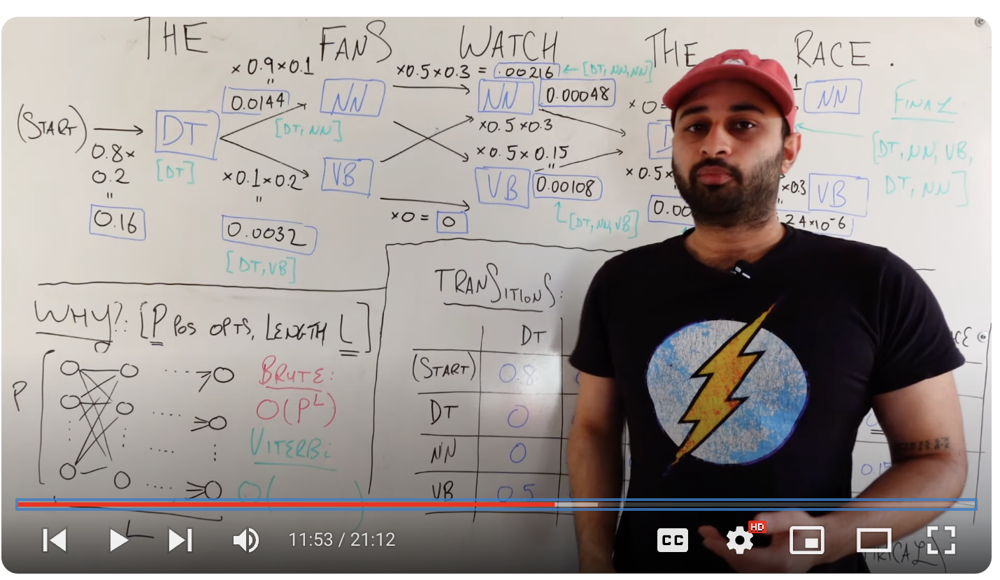
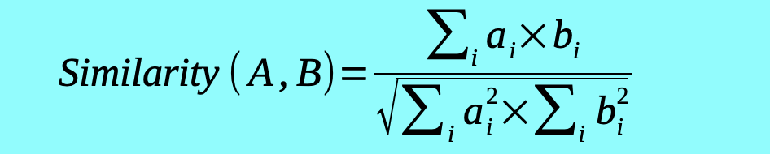
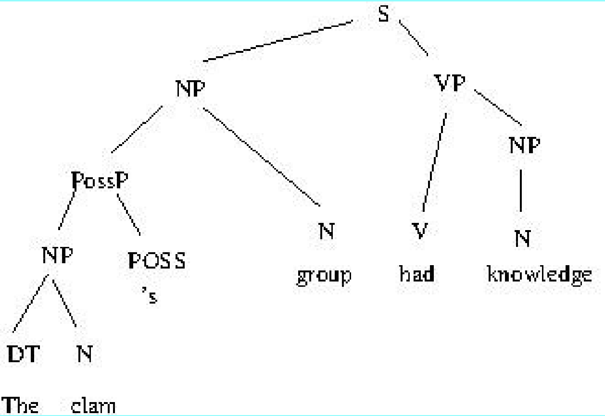

# 1/23/24
java -jar mae
ctrl-leftclick
first assignment is to label adjectives, along with their position and morphology

# 1/30/24
### Lowest level syntactic processing (text)
- tokenization and segmentation
    - given a sentence, determine the words or word like units that it consits of
- part of speech tagging
    - apply a set of part of speech tags to a set of tokens

### Low level syntactic processing
- named entity tagging
    - mark boundaries of names of type PERSON, ORGANIZATION, FACILITY, GPE, LOCATION,...
    - <ENAMEX TYPE = "PERSON">Adam Meyers </ENAMEX> works for <ENAMEX TYPE="ORGANIZATION">New York University</ENAMEX>
- chunking
    - mark verb groups and/or noun groups, convenient approximations of syntactic units
    - less expensive processors and nlogn, but lose some detail
    The book with the blue cover will end up on the shelf.
        - [NG The book] with [NG the blue cover][VG will end up] on [NG the shelf]

### Parsing: High level syntactic processing
- n^3 time

### semantics - ish
- semantics - a wide range of topics loosely referring to meaning
- ex. the word "bank"
    - some are financial, some are geographic detail, etc.

### word sense disambiguation
- interesting characterizations of word senses, use WordNet

### predicate argument structure
- meaning is expressed by saying which two things mean the same thing
- linguists have employed systems to characterize predicatable paraphrases
- semantic role labeling is popular to do this
    - "They were eaten by a giant clam" and "A giant clam ate them"
        - patient relationship between eat and they
        - agent relationship between eat and clam
    - "John took a walk to the store" and "John walked to the store"
        - mean the same
### anaphora
- coreference
    - two phrases mean the same thing
    - "Though big blue won the contract, this official is suspicious of IBM"
        - Big blue and IBM the same
- other varieties
    - john ate a sandwich and mary ate one also [type coref]
    - the amusement park is very dangerous. the gate has sharp edges. the rides have not been inspected. [bridging anaphora]
    - this book is valuable, but the other book is not [other coref]
        - same type but cant be the same book

### discourse argument structure
- adverbs, subordinate/coordinate conjunctions, among other words link clauses

### semantic parsing
- Professor's version is called GLARF

### role of manual annotation
- manually encode systems so that you can fine tune task definitions and guidelines
- several annotators must agree on classification most of the time
- if humans cant agree, it is unlikely that a computer can do the task at all
- used to create answer keys to score system output
    - recall
    - precision
    - F-score
ex.
correct = 8 // correct answers supplied by system
system = 10 //answers supplied by system
answer = 12 // answer key
correct/system == 8/10 // this is precision, what percentage of the system answers is correct
corrrect/answer = 8/12 // this is recall, percentage of right answers

### manual annotation in supervised statistical ML
- divide the corpus into sub corpora
    - a training corpous to acquire statistical patterns
    - a test corpus to measure system performance
    - a development corpus similar to test corpus

## lecture 2 slides
### formal language
- set of strings of symbols
- formal language can model a phenomenon eg. written english modeled after the sounds of english
- ex. all combinations of the letters A and B: ABAB,AABB,AAAB,etc
- ex. mathematical equations: 1+2=5, 2+3=4
- ex. musical notation

### formal grammar
- set of rules that matches all and only instances of a formal language
- in CS, formal grammars are used to generate and recognize formal languages (eg. programming languages)
- parsing a string of a language entails
    - recognizing the string and recording the analysis showing it is part of the language
    - a compiler translates from language X to language Y
- consists of:
    - N: finite set of nonterminal symbols
        - symbols that can be replaced by other symbols
    - T: finite set of terminal symbols
        - symbols that cannot be replaced by other symbols
    - R: set of rewrite rules eg. XYZ -> abXzY
        - replace the symbol
    - S: special nonterminal that is the start symbol

what is good grammar? chomsky hierarchy defines types of formal grammar
- from least expressive, most efficient processors to most expressive, least efficient

### regular expressions
- standardized way of representing search strings
'(BB)|([^B]{2})' //to be or not to be

# 2/6/24
# HMM and Part of Speech Tagging
HMM is describing the probability of the next part of speech based on the current state
Markov chain means each set of possibilities is only based on the current state
    - whatever is happening now directs what happens next

### viterbi algorithm
- two words: fish and sleep

viterbi[s,t] =
max(s') viterbi[s,t-1] (probability of previous token)
P(s|s)
P(..fsdjklfkj)
- s is state, t is a token

in our training corpus
- if fish appears 8 times as a noun and 5 times as a verb
- sleep appears twice as a noun and 5 times as a verb
Noun
- p(fish|noun): 0.8
- p(sleep|noun): 0.2
....

# video notes on Part of Speech Tagging
### part of speech
    - pronoun
    - verb
    - determiner
    - noun
    - etc.
- how do we get a computer to identify these?
    - also if we have words, what should we expect next?
#### Methods for this
- rule based
    - if -> then
    - ex. if theres a noun, then there will be a verb
    - based on linguistics
    - so many cases to consider though
- stochastic (probability based)
    - hidden markov model
        - "i eat pizza"
            - each word is an observed variable
            - hidden variables are the part of speech
            - so observing words, what is the most likely part of speech? maximize the combinations of part of speech that gives us the highest probability of these words
    - MAX P(p1...pn,w1,...,wn)
        - p being parts of speech
        - w being words
        - say n is 5 for p
            - then combinations is 5^10 -> 10 million combinations
            - this is way too large esepcially since there are more than 5 parts of speech
        - in comes **viterbi algorithm**
# Notes on Hidden Markov Model
- ex. professor is one of two moods (happy or sad)
    - mood on a given day depends only on mood from previous day
    - if professor is happy on t-1 (previous day) -> 0.7 change she'll be happy today and 0.3 change she'll be sad today
    - if sad on t-1 -> 0.5 happy 0.5 sad today
    - these are called the transition probabilities
- emission probabilities
    - color shirt she's wearing depends on mood of a given day
    - new distribution
    - if happy (0.8 red, 0.1 green, 0.1 blue)
    - if sad (0.2 red, 0.3 green, 0.5 blue)
- so the markov model contains transition probabilities (hidden states) and the emission probabilities (these are what we actually observe)
    - hidden states directly affect observed states
- say its 3 days in the course and professor wears green, blue, red shirt on those 3 consecutive days
C1 = G, C2 = B, C3=R
    - what are the most likely moods of the professor on these days?
    - so based on what we're seeing, what is the most likely hidden state?
Maximize the probability (c1,c2,c3,m1,m2,m3)
    - 3 colors on each day and 3 moods for each day
    - which combinations of moods gives us the highest probability
        - so the proabbility of seeing this color sequence with these moods are maximized -> so its the most likely sequence of moods

this is the probability broken up
P(c3 | c2c1m3m2m1)
P(c2 | c1m3m2m1)
P(c1 | m3m2m1)
P(m3 | m2m1)
P(m2 | m1)
P(m1)
- but the probability of color shirt on a certain day only depends on the mood on a certain day -> this is the assumption
- and the probability of a mood on one day only depends on the mood of the previous day -> the markov assumption
P(c3 | m3)
P(c2 | m2)
P(c1 | m1)
P(m3 | m2)
P(m2 | m1)
P(m1 | s)
- so the probabilities become this
- we find that the highest probability of moods is {S S H} sad sad happy

# Notes on Viterbi Algorithm
- key idea of Part of Speech tagging is to use hidden markov model
- but how do we do this efficiently?
#### an example
"THE FANS WATCH THE RACE"
- THE is a determiner
- FANS WATCH and RACE can be nouns or verbs
- 8 possibly combinations for part of speech tagging
- so we have p1, p2, p3, p4, p5 , one for each word
- we want MAX P(p1,p2,p3,p4,p5, THE, FANS, WATCH, THE, RACE)
- broken down this is MAX $\prod \mathbb{P}(p_k|p_{k-1}) \prod \mathbb{P}(w_k|p_k)$
    - transmissions first product
    - emissions second product
- go back to HMM probability list if confused, you can see that part of speech only depends on part of speech from previous part of speech and word only depends on the part of speech
- we need data for transitions and emissions probabilities
    - these are from empirical data -> underlying training set where parts of speech are labeled
    - this ends up in a 2d table with parts of speech on one axis, words on another axis, and their probabilities
        - ex. determiner and THE has probability 0.2
        - ex. noun and WATCH has probability 0.3
        - in our case these highest probabilities are wrong for our sentence! the viterbi alg with solve this, these are just raw probabilities from data
#### where are we saving time with viterbi?
- this is that flow tree

- THE FANS WATCH THE RACE
- START -> THE
    - first question: given start of sentence what is probability that first word is determiner and that is the word THE
    - two numbers, one from transition, one from emission
        - 0.8 first word determiner, 0.2 determiner and the word THE
    - multiply together to get 0.16
        - this number represents if we cut off the sentence right there, whats the probability of observing this information, so so far Determiner start and THE
- next pretend we assign FANS as a noun
    - whats the probability we transition from determiner to noun 0.9
    - whats the probability that the noun is FANS 0.1
    - multiply with previous 0.16 -> 0.0144
        - so this is THE FANS with FANS as a noun
- but what if FANS is a verb
    - 0.1 and 0.2 (same process as above) to get 0.0032 with THE FANS with FANS as a verb
    - this is lower prob, why not just stop this branch?
        - we dont know whats gonna come next, the prob could be higher later in this chain
- basically multiply part of speech transition (verb to noun, noun to verb, etc) and probability that the word is a certain part of speech (THE is a determiner, WATCH is noun or verb, etc)
- you can discontinue paths that have a lower probability if there are two pathways to the same node
    - ex DT NN NN has 0.026 and DT VB NN has 0.00048 so DT NN NN is smaller but we arrived at the same NN node
    - this is why Viterbi is more efficient!
- so get to the last word and you should have possibly multiple probabilities
    - choose the higher one
    - in this case it was [DT NN VB DT NN], which is correct
    - THE FANS WATCH THE RACE

# 2/8/24
### implementing viterbi in python
- dictionary that maps a part of speech to a bunch of words
    - likelihood: {DT: {the:5, a:6, an:7}}
    - tag DT occurs as word 'the' 5 times
- dictionary that maps POS to POS
    - transition: {DT: {NN:5,VS:7}}
    - tag DT transitions to NN 5 times
    - first state will be "Begin_Sent" and last will be "End_Sent"
- maybe have a set that contains the words that occur once
    - this is so we can detect OOV(out of vocabulary) words

### BIO tags
- way to recognize multi token chunks using viterbi
- B //begin constituent
- I //inside constituent
- O // outside constituent
- ex. Adam /B-Name Meyers /I-Name teaches /O-Name at /O-name
- idea is to take tags on single words and use it to mark something in a span

# Vector Similarity
- vectors represent documents, blocks of text or phrases
- use words to classify documents and blocks of text
    - information retrieval, question answering
        - retrieve documents that are "similar" to query
    - document classification, sentiment analysis
        - using similarity to group similar doucmnets
### documents and chunks of text
- doucment //vector representing its parts
    - parts are words, n-grams, chunks...
    - and measuring each part's importance
- 2 documents represented by vectors
    - you can measure similarity using vector similarity
    - documents within a genre, documents with same "sentiment" (sentiment analysis)
        - prof is hesitant of sentiment analysis because the data is questionable
### ad hoc information retrieval (IR)
- given a collection of documents and a query
    - ex. set of recipes and query "chicken soup with noodles"
- find documents that "best" match the query
- assumptions:
    - each document is a bag of terms
    - each query is a bag of terms
- so a bag of words, undordered set of words like chicken or word sequences like "ice cream" or "frying pan"
- so a term can be a word, a bigram (2 consec words), trigram, noun group, etc
- query is user input, typically set of terms
- goal is to find doucments that are closest to the query and maybe rank them
- big example of this -> web search
    - IR is a component but there's other components as well
    - another component like googles pagerank determines that there's a lot of links pointing to this page (prominence)
### vector representations
ex. Chicken soup with noodles as a query
bean: 0, chicken: 5.4, noodle:2.7, stew: 0, soup:5.1
ex. recipe for chicken rice stew
bean: 0, chicken: 16.2, noodle: 0, stew: 3.1, onion: 2.7
- when comparing these you can intuitively see
    - look for same positions with zero values
    - smaller difference between non zero values
    - most "important" positions tend to be similar
- but how do we quantify this process?

### TFIDF = common weight for vector
- scoring a term for how "important" it is in a document
- term frequency -> number of times a term t occurs in document
- inerse document frequency: reciprocal of portion of large document set that contains term t, normalized with log function
    - measure of how rare a term is
    - if a term is in lots of different documents, it will have a low score
    - if it is in small number, it will have a high score
- TFIDF(t) = TF(t) x IDF(t)
    - so its scores terms highly that occur frequently in a doc or query
    - and scores terms highly that are infrequent in collection
- so TFIDF(t) is high if t is more frequent in document d than t is in most documents

#### an example
- noodle
    - occurs 3 times in chicken noodle soup with coconut recipe
        - term frequency = 3
    - occurs in 4 out of 10000 documents in collection
    - inverse doc frequency is log(10000/4) = log(2500) = 7.82
    - TFIDF = 3x7.82 = 23.46
- tablesppon
    - occurs 4 times
    - occurs in 1200 out of 10000 documents
    - IDF = log(10000/1200) = log(8.33) = 2.12
    - TFIDF = 4x2.12 = 8.48
- so noodle is more highly weighted than tablespoon

### cosine similarity: common similarity score
- commonly used with TFIDF for two vectors to measure the similarity
- so TFIDF scores words that build a vector for a document, and cosine similarity measures the angle between the two vectors
- its the cosine of the angle between the vectors
- smaller angles have higher cosines
    - but we want a small angle between vectors
- if query is A and document is B
- cosine similarity is high if values of a and b are similar
- maximum = 1, if a = b
- values in the vectors are TFIDF scores for each document or query

- dot product the two vectors for the numerator
- denominator -> square all the values of vector first, then dot product, then take square root

### evaluation metrics
- correct = length(system output joined with answer king)
- precision: correct / len(system output)
- recall: correct / len(answer key)
- f measure = 2 / (1/precision) + (1/recall)

### why might we want higher precision/recall?
- voice recognition of helicopter commands
    - precision is more important than recall
    - an error is a disaster, better to produce no output and let pilot keep control
- finding lost children
    - recall is more important than precision
    - missing a child is a disaster, better to question some children who are not lost

### MAP - Mean Average Precision
- compute the precision at several levels of recall, then average
    - if high ranked items in list tend to be better, the score is higher

# 2/13/24
### Question answering task
- given a query and set of documents
- find the paragraph (not a document) that is closest to the query
- this assumes the answer to the question will be in the paragram

### supervised document classification
- given N sets of seed documents (classified - categories, genres, topics)
- and a set of unclassified documents
- goal
    - automatically assign new documents to "closest" category

### sentiment analysis
- breaks up documents into positive vs negative vs neutral views
- professor thinks this is hard to do well

### lexical semantics
#### lemmas and wordforms
- lemma: basic word form (paired with POS) used in lexicon
    - base form representing a set of inflected forms
    - singular nouns: book -> book, books
    - base infinitive verbs: be -> be, being, been, am, is...
    - base adjective: angry -> angry, angrier, angriest
- word form: word how it actually occurs
    - a single wordform can be related to multiple lemmas:
        - bases is the plural of basis and base
        - leaves is the plural of leaf and leave (as in leaves of absence)

# 2/20/24
### terminology extraction
- find diverse words, domain specific words from a text
- given a document about a topic (foreground)
- and given a set of documents about diverse topics (background)
- find list of terms/words that are more characteristic of foreground than background

### word/sentence distribution
- how do we predict sequences of words? how do we distinguish sentences from non sentences?
- statistically - N-gram probabilities predict the occurrence of words based on the occurrence of N-1 previous words eg. the follows the word in about 28% of the time
- syntactically - phrases are sequences of words that form equivalence classes based on how all phrases fit together
    - The giant chicken from brazil and john's homework assignment are both noun phrases
    - replacing an NP in a well formed sentence with another NP will probably result in a well formed sentence

### statistical language models
- probability distrbution over sequence of words
- used to rank word sequences by likelihood
    - rank multiple output of machine translation, language generation, voice recognition, etc
    - assume correct answer is highest ranked output
    - language model produces multiple translations -> are the outputs possible likely english
- generalized in various ways
    - like the POS tagger
    - N-grams of character sequences, phoneme sequences

### training vs dev/test corpus
- statistics on words are derived from training corpus (like the brown corpus)
- statistics used to predict occurrrence of words in other corpora
- we are assuming this training corpus is representative -> which can be flawed

### unigrams
- every word, instance of punctation, and select other items are tokens
- A fact abou tht eunicorn is the same as an alternative fact about the unicorn
    - include the period
- counts of these words in brown corpus using NLTK
    - ex. a:23195, fact:447, etc
- probability of each token chosen randomly
    - divide word frequency by total words
    - unigram probability
    - ex. a: 0.02, fact: 0.0000385
- if we multiply all these probabilities together we get 0, since there are OOV words
- unigram probability of sentence = product of probabilities of individual words
    - but if we have OOV its 0 right, so we need to handle them
    - one OOV model: assume words occurring once are OOV and recalculate counts
    - but this value of 1 might skew the probability of an OOV word, so choose another number N

### bigram
- probability of word given previous word, n and n-1
    - bigram(the,same) = count(the,same)/count(the)
    - this is similar to POS tags
    - probability of "the same" given previous word is "the"
- additional steps
    - include probability for beginning and end of sentence -> bigram(the,START) and bigram(END,.)
- backoff model
    - if a bigram has a zero count, "backoff" or use the unigram of the word instead
    - replace bigram(currword,prevword) with unigram(currword)
    - so if curr word or prev word is OOV, replace with unigram of curr word

### also trigrams, 4 grams, n grams
- people rarely use anything higher than trigrams

### markov assumptions
- unigram : probability of words are independent of each other
- bigram: probability of word depends only on previous word
- trigram: prob depends on 2 previous words
- etc.

### phrase structure model of language
- possible sentences in a language are modeled by a set of context free phrase structure rules

### An example -> english' -> simplified version of english
- N = {S,VP,NP,POSSP,PP}
- T = {N,P,D,POSS}
    - noun, preposition, determiner, possessive mark
- S = sentence
    - english' only handles declarative tensed clauses and ignores other kinds of sentences
- set of words as well

#### grammar
- ex. S-> NP VP
- VP -> V
    - verb phrase can be just a verb
- VP -> V NP
    - or it can be verb or noun phrase
- etc.

#### lexicon
- D-> the, D-> a, D-> this
- etc for all other POS...

### random sentence generator
- algorithm
    - set output to S
    - repeat until output contains only words
        - replace the 1st element Q in output that is not a word
            - if Q is a nonTerminal
                - randomly choose a rule Q -> a, where a is a string of terminals and/or non terminals
            - else
                - replace it with a word from the lexicon of class Q

### examples
- Literal privations cautiously reined
- swellings recorded stills
    - notes: there's some semantic problems even though there's syntactic correctness
S expands to NP or VP
NP expands to plural noun
plural noun expands to 'males'
etc.

### implementation of a random sentence generator
- implement with a stack
    - keep expanding if not a word, add expansions to the stack, if its a word add to the result
    
# 2/22/24
### manual parsing examples
- The ice cream truck ended up in New Jersey.
    - "up" is a particle -> modifies a verb
    - make a tree of Noun phrase, verb phrases, lowest level close to the word is the actually part of speech
- Mary said that she knew about linguistics
    - "that" is SBAR -> additional information about the main clause

### lead to parsing alg - chomsky normal form (CNF)
- set of rules
- combines at most two items at a time when parsing

#### ex.
- replace VP -> V NP PP with 2 rules:
    - VP -> VG PP
    - VG -> V NP
    - so need to break these up
- come up with NG(noun group) and VG(verb group) to split these

### CKY Parser alg: tokenization
- tokens and positions between tokens
- just indexing in coding basically (index from 0 for each word)

# 2/27/24
### shallow or partial parsing
- finding constituents in a sentence, but not parsing the whole sentence
    - shallow parsing identifies "short phrases"
        - like noun group, verb group chunking
        - NE tagging
        - identifying time expressions
        - other phrases in text
    - faster and usually more accurate -> decrease error but less detail

### what is a named entity?
- def 1: a single or multi word expression that meets any of the following criteria
    - is a proper noun phrase phrase
            - Kevin Garcia
            - Professor Garcia
            - New York University
    - is a proper adjective phrase eg. latin american
    - has external distribution of NP, but different internal structure
        - Five Hundred Thirty
        - waffles@cs.nyu.edu
- def 2: a class of words and multi word expressions defined by specifications tuned to information extraction tasks
    - hierarchy of words

### annotating names in sample docs
#### examples
- ex. "albert einstein" is a name
- but "minowskis special theory of relativity" is not a name you would find in other documents
    - its special
- ex. "Mr. Speaker"
    - usually when you have Mr. its followed by a last name
    - but even though its not a normal name -> it has has the internal structure of a name
    - so maybe a name spec is Mr. followed by a title
- ex. "State of the Union"
    - its special, need to create specifications

#### in practice
- types
    - GPE = location with a government or set of GPEs
        - geopolitical entity
    - PER = person or set of people
    - ORG = organization, club, society, etc.
        - set of people with governing structure
        - overlaps a bit with GPE
    - Other = word sequence widely recognized as name (not the best definition)

### what is a proper noun (Phrase)?
- def. a name of something that is capitalized even in non initial position, typically representing a unique individual object. proper nouns don't typically take determiners
- what's unique?
    - is Adam Meyers a proper NP even though there are more than one person with the name
    - are colors names? they are unique
- capitalization solution is inconsistent
    - it also doesn't work in all languages

### ACE named entities
- GPE -> location with a government
    - city, state, country, county
    - people, phys. location, government
    - US, NYC, queens, greenwich village
- location -> geographical location
    - lake, mountain, natural structure
    - Hudson River, Mt. Mckinley, the Grand Canyon
- facility -> man made structure
    - bridge, street, building
- person -> person or group of people
- organization -> group of people with structure
    - commercial, government, club, non profit

# 3/5/24
## midterm review
